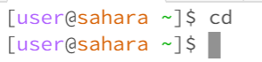
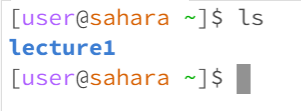
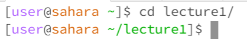
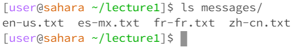
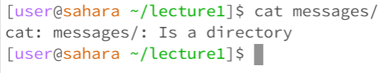
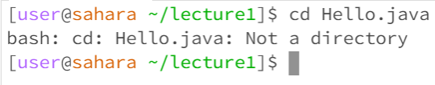
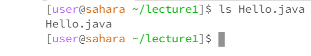
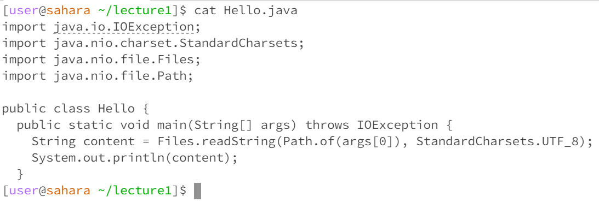

# No Arguments (cd)

-The command was run in the home directory.

-I got the output that I got, which was no output, as I did not provide any directory to change into.

-The output is not an error as when `cd` is ran, it returns you to the `home` directory.

# No Arguments (ls)

-The command was run in the home directory.

-I got the output of the lecture1 directory as I ran the `ls` command in the `/home` directory. The only contents of the `/home` directory is the `lecture1` directory.

-The output is not an error as the `ls` command properly listed the components of the current directory.

# No Arguments (cat)

-The command was run in the home directory.

-When `cat` was run, there was no output. Instead it was asking for an input and when "enter" was clicked, it would repeat what was typed as the input until I cancelled it with "CTRL + D".

-The output is not an error. There were no arguments provided to the `cat` command so it was not able to concatenate anything.

---

# Directory Argument (cd)

-The command was run in the home directory.

-When the `cd` command was run, provided the "lecture1/" argument, the directory was changed to the "lecture1" directory.

-The output is not an error as `cd` is used to change directories. Because we chose to change into the `lecture1` directory specified by the argument, the `cd` command did what it was supposed to.

# Directory Argument (ls)

-The command was run in the lecture1 directory.

-The output resulted the contents of the messages directory. These displayed contents consisted of the files of different languages.

-The output was not an error as we ran `ls` in lecture1 with the argument "messages/". Since the `messages/` directory is located in the `lecture1/` directory, the program correctly outputted the contents of the messages directory as per ls's command definition.

# Directory Argument (cat)

-The command was ran in the lecture1 directory.

-The command did not work as `cat` does not work with directories.

-The output was an error that said "cat: messages/: Is a directory". It is an error because cat does not directories as an argument.

---

# File Argument (cd)

-The command was run in the lecture1 directory.

-The command did not work as `cd` only works to change directories.

-The output was an error that said "bash: cd: Hello.java: Not a directory". This is an error as the `cd` command only takes in directories as an argument.

# File Argument (ls)

-The command was run in the lecture1 directory.

-The command did work as `ls` works for all directories and files that have contents. A content of a file is itself, therefore the command was correct in returning the file that was used `ls` on.

-The output was a successful with the result of listing the file that was run `ls` on.

# File Argument (cat)

-The command was run in the lecture1 directory.

-The command was ran on the "Hello.java" file and the the result of the `cat` function was the contents of the Hello.java file.

-The result was not an error as when the `cat` funciton is ran on a file, it returns the contents of the file that the function was ran on.

