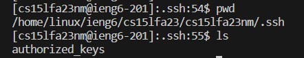

# Part 1
## StringServer Code

The following code is the contents of StringServer.java

## /add-message usage
### Screenshot 1

- The method that is called in this code would be the `handleRequest` method.

- In this method the relevant argument would be the url that we have typed. Along with this the method has relevant values. Two of the main values that are created as the method is called are the String arraylist `text`, which is used to hold the strings inputted, and the integer `len`, which is used to hold the value of the length of `text`. Since it is the first time calling the function, the value of `text` will be an empty arraylist and the value of `len` will equal 0. Since `url.getPath().equals("/")` is false the function goes into the else statement and since `url.getPath().equals("/add-message")` is true, the fucntion creates the empty String variable `response` and the String array `parameters` that hold the value of the query split by the `=` sign.

- If the first value of the query or `parameters[0]` is equal to the string value `"s"`, then the text present in `parameters[1]` is added to the the arraylist `text`, then the value of `len` is incremented by 1. After this, the value of `response` is updated with the values of `text` and their respective index.

### Screenshot 2

- The method that is called in this code would be the `handleRequest` method.

- In this method the relevant argument would be the url that we have typed. Along with this the method has relevant values. Two of the main values that are created as the method is called are the String arraylist `text`, which is used to hold the strings inputted, and the integer `len`, which is used to hold the value of the length of `text`. Since it is the second time calling the function, the value of `text` will be not be empty, but will contain the previous imputted value and the value of `len` will equal 1 since it will have been incremented the previous time the function was ran. Since `url.getPath().equals("/")` is false the function goes into the else statement and since `url.getPath().equals("/add-message")` is true, the function creates the empty String variable `response` and the String array `parameters` that hold the value of the query split by the `=` sign.

- If the first value of the query or `parameters[0]` is equal to the string value `"s"`, then the text present in `parameters[1]` is added to the the arraylist `text`, then the value of `len` is incremented by 1. After this, the value of `response` is updated with the values of `text` and their respective index.

# Part 2
### Path to private key in local computer

### Path to public key in ieng6 account

### Logging into ssh with no password

# Part 3
One thing that I learned in week 2 and 3 was hwo ot build and start a server as well as how to edit it to return things that I wanted it to return. For example, I previously did not know how localhost worked, but now I have a better understanding of creating local servers. Along with this, I have gained a much better understanding of hwo a url functions and how part of it are filtered, such as the path, query, etc.

