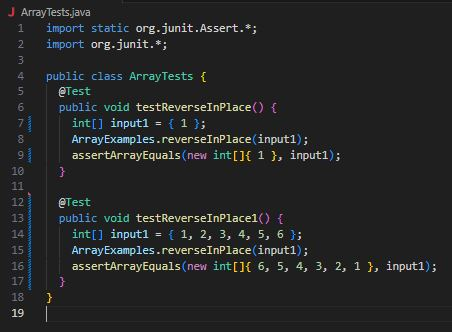
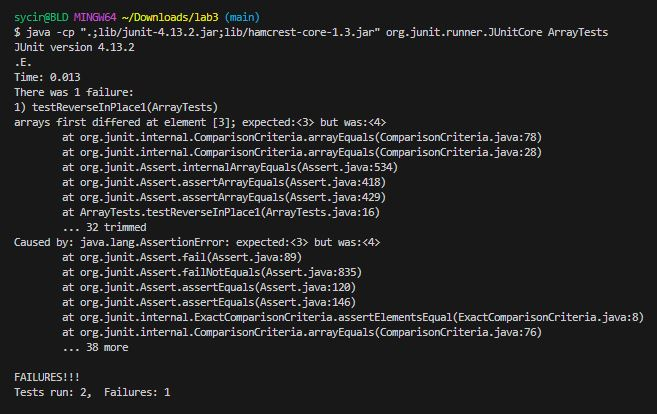

# Part 1 - Bugs
For this part of the lab I chose to do the following answers on the ArrayExamples.java file.

## Failure Inducing input for ArrayExamples.java reverseInPlace method
```
public class ArrayTests {
	@Test 
	public void testReverseInPlace() {
    int[] input1 = { 1, 2, 3, 4, 5, 6 };
    ArrayExamples.reverseInPlace(input1);
    assertArrayEquals(new int[]{ 6, 5, 4, 3, 2, 1 }, input1);
	}
}
```

## Input that doesn’t induce a failure for ArrayExamples.java reverseInPlace method
```
public class ArrayTests {
	@Test 
	public void testReverseInPlace() {
    int[] input1 = { 1 };
    ArrayExamples.reverseInPlace(input1);
    assertArrayEquals(new int[]{ 1 }, input1);
	}
}
```

## Symptoms of running the above tests
These were the tests ran:


The follwoing was the result of running the above tests


## Code changes to fix the bug in the method.
Code of the reverseInPlace method before:
```
static void reverseInPlace(int[] arr) {
  for(int i = 0; i < arr.length; i += 1) {
    arr[i] = arr[arr.length - i - 1];
  }
}
```

Code for reverseInPlace method after the fix:
```
static void reverseInPlace(int[] arr) {
  int temp = 0;
  for(int i = 0; i < arr.length/2; i += 1) {
    temp = arr[i];
    arr[i] = arr[arr.length - i - 1];
    arr[arr.length - i - 1] = temp;
  }
}
```

# Part 2 (all ran in `./technical/`)
## Search for a file with a specific name in a specific folder
### Example 1
```
#Command ran
find ./911report/ -name *.txt

#Result
./911report/chapter-1.txt
./911report/chapter-10.txt
./911report/chapter-11.txt
./911report/chapter-12.txt
./911report/chapter-13.1.txt
./911report/chapter-13.2.txt
./911report/chapter-13.3.txt
./911report/chapter-13.4.txt
./911report/chapter-13.5.txt
./911report/chapter-2.txt
./911report/chapter-3.txt
./911report/chapter-5.txt
./911report/chapter-6.txt
./911report/chapter-7.txt
./911report/chapter-8.txt
./911report/chapter-9.txt
./911report/preface.txt
```
### Example 2
```
#Command ran
find ./government/About_LSC -name *.txt

#Result
./government/About_LSC/Comments_on_semiannual.txt
./government/About_LSC/commission_report.txt
./government/About_LSC/conference_highlights.txt
./government/About_LSC/CONFIG_STANDARDS.txt
./government/About_LSC/diversity_priorities.txt
./government/About_LSC/LegalServCorp_v_VelazquezDissent.txt
./government/About_LSC/LegalServCorp_v_VelazquezOpinion.txt
./government/About_LSC/LegalServCorp_v_VelazquezSyllabus.txt
./government/About_LSC/ODonnell_et_al_v_LSCdecision.txt
./government/About_LSC/ONTARIO_LEGAL_AID_SERIES.txt
./government/About_LSC/Progress_report.txt
./government/About_LSC/Protocol_Regarding_Access.txt
./government/About_LSC/reporting_system.txt
./government/About_LSC/Special_report_to_congress.txt
./government/About_LSC/State_Planning_Report.txt
./government/About_LSC/State_Planning_Special_Report.txt
./government/About_LSC/Strategic_report.txt
```
## Search for empty files and directories
### Example 1 (I added an empty file called empty.txt in `911report/` and `government/About_LSC/`)
```
#Command ran
find ./government/About_LSC/ -empty

#Result
./government/About_LSC/empty.txt
```

### Example 2 (I added an empty file called empty.txt in `911report/` and `government/About_LSC/`)
```
#Command ran
find ./911report/ -empty

#Result
./911report/empty.txt
```

## Displays repositories and sub-repositories
### Example 1
```
#Command ran
find . -type d

#Result
.
./911report
./biomed
./government
./government/About_LSC
./government/Alcohol_Problems
./government/Env_Prot_Agen
./government/Gen_Account_Office
./government/Media
./government/Post_Rate_Comm
./plos
```

### Example 2
```
#Command ran
find ./government/ -type d

#Result
./government/
./government/About_LSC
./government/Alcohol_Problems
./government/Env_Prot_Agen
./government/Gen_Account_Office
./government/Media
./government/Post_Rate_Comm
```


