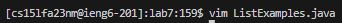

# Lab 4
## Starting from Step 4 - Log into ieng6
In the terminal type the command `ssh cs15lfa23nm@ieng6.ucsd.edu` and press <enter>. This will allow you to log in to the ieng6 server.

## Step 5 - Clone your fork of the repository using the ssh url
Go to your forked reposity, click the green button that says "Code", make sure you are in the "ssh" tab and copy the link by clicking the button to the right of the link.

After copying the link, you would go back to your terminal, typing `git clone`, and pasting the link using <control> and the "v" key at the same time, resulting in typing out the line `git clone git@github.com:Avikovi/lab7.git`, then press <enter>.

Finally, cd into the new folder by typing `cd lab7` and press <enter>.

## Step 6 - Run the tests, demonstrating that they fail
To run the tests we need two run two commands. The first command we run is to compile the java files in our folder which we can do by typing `javac -cp .:lib/hamcrest-core-1.3.jar:lib/junit-4.13.2.jar *.java` into the terminal and pressing <enter>.

The second command we need to run is to actually run the new complied files. We can do this buy typing `java -cp .:lib/hamcrest-core-1.3.jar:lib/junit-4.13.2.jar org.junit.runner.JUnitCore ListExamplesTests` into the terminal and pressing <enter>.

## Step 7 - Edit the code file to fix the failing test
The first step to edit the file is to vim into it by typing `vim ListExamples.java` into the terminal and pressing <enter>.

Once in the vim editor of the file you can type `/index1`press <enter> then type `#` using the <shift> and <3> keys at the same time to get the cursor to the "i" in the last index1 reference. Press your right arrow key 5 times (<right><right><right><right><right>) then press <r><2> to change the "1" to a "2".

After chaning the file using vim, we need to save and exit. To do this we need to press the following keys: <esc><:><w><q><enter>.
Before pressing "enter" is will look like this:

## Step 8 - Run the tests, demonstrating that they now succeed
To run the tests we can just rerun our previous lines that we ran. To do this we can use our arrow keys. Keys pressed in the terminal: <up><up><up><enter>.

Then we need to run the java command again. Keys pressed in the terminal: <up><up><up><enter>.

## Step 9 - Commit and push the resulting change to your Github account
To commit and push the changes, we first need to type in the terminal `git add *` and press <enter>.

To check the files we have added, we can type in the the terminal `git status` and press <enter>. The files that will be added will be in the color green.

To commit the added files we need to type `git commit -m "Updated"` and press <enter>. This will commit our changes while keeping the note commited with them as the comment "Updated"

Finally we can push our changes to the repository by typing the command `git push` into the terminal and then pressing <enter>.

