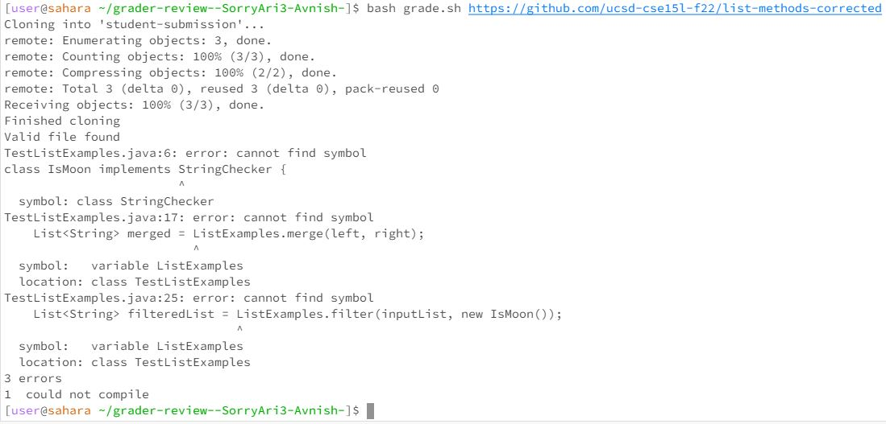
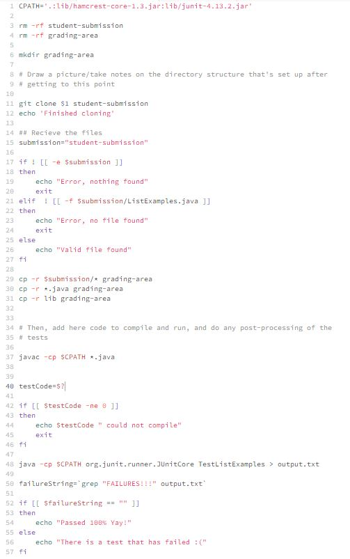
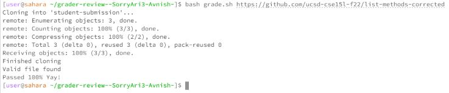
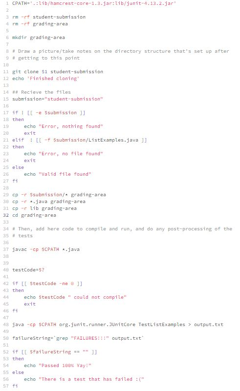

# Lab 5
## Part 1 - Debugging Scenario
### Original Post from student
I ran my code and the terminal resulted in the following error. I am not really sure why this error is happening but I think it has something to do with my `grade.sh` file or the functions not being defined. I have attatched both my terminal result as well as my grade.sh code below.

Terminal result:

grade.sh code:

### Response from TA
You are correct in identifying where the error in te code is. In grade.sh, it might be beneficial for you to keep in mind your currect working directory after each command as if you are not in the correct working directory, some files might be out of scope causing those functions to not be found.

### Reply from Student
I ran through the `grade.sh` file keeping in mind the working directory and I found the error, it turns out that I just did not change my directory to the `grading-area` folder. This is making sense now as those commands are defined in that folder, so wihtout changing my directory, those files do not exist within the scope. Once I added that line, my code passed the test cases and is working correctly! Thank you!
Terminal result:

grade.sh code:

## Part 2 - Reflection
One major thing that I learned in this half of the quarter that I knew nothing about before was the bash commands for file exploration and text analysis in the command line as well as scripting. I was not aware taht there were ways through the command line to filter certain words and get information such as word count, line count, etc. from the command line. Although very challenging, I found this very interesting and also useful for the future when I use bash.
